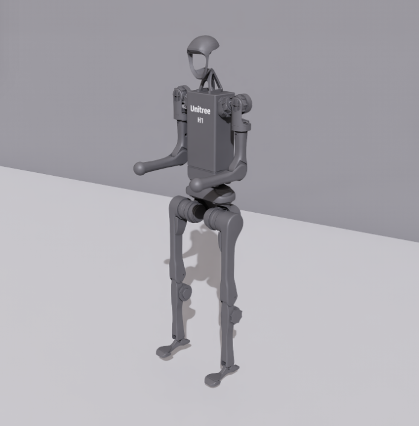

# Unitree H1 Robot Simulation Assets

## Overview

This package contains robot assets for the [H1](https://www.unitree.com/h1) developed by [Unitree](https://www.unitree.com/).

The subfolders contain:

- **urdf**: Robot description format files
- **mjcf**: MuJoCo XML files
- **meshes**: Mesh data consumed by both URDF and MJCF
- **usd**: Universal Scene Description format files
- **usd_structured**: Structured USD layer files, converted from MuJoCo Menagerie MJCF

## Sources

### URDF and MJCF

The MJCF, URDF and mesh files were retrieved from the [unitree_ros repository](https://github.com/unitreerobotics/unitree_ros/tree/master/robots/h1_description) at a3b70ca.

In the URDF, the mesh paths were updated to match the asset folder name.

### USD

The USD model was collected using IsaacSim from the IsaacLab robot assets. The specific source URLs are available in the [collection record](usd/.collect.mapping.json).

For changes made to the model for simulation in Newton, please refer to the Git commit history of this folder.

### Changelog

- 2026-02-26: Added `physics:principalAxes` quaternions for inertia tensors in `usd/h1_minimal.usda`.

## License

This model is released under a [BSD-3-Clause License](LICENSE).
