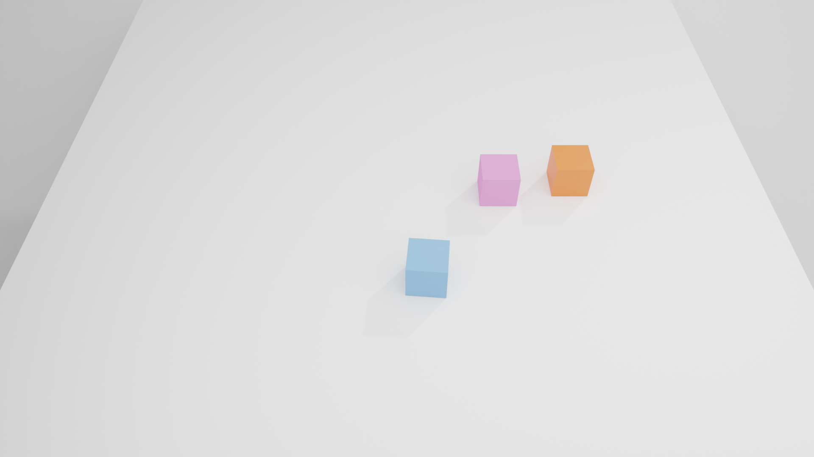

# LuisaComputeSolver: Physics Simulator Based on LuisaCompute


[](https://github.com/ChengzhuUwU/LuisaComputeSimulator/actions/workflows/cmake_linux.yml)
[](https://github.com/ChengzhuUwU/LuisaComputeSimulator/actions/workflows/cmake_windows.yml)
[](https://github.com/ChengzhuUwU/LuisaComputeSimulator/actions/workflows/cmake_macos.yml)


LuisaComputeSimulator is a high-performance cross-platform **Physics Simulator** based on [LuisaCompute](https://github.com/LuisaGroup/LuisaCompute), providing support for **Cloth and Rigid-Body** simulations and support for **Penetration-Free** contact handling, accelated by variant GPU/CPU backends(e.g., CUDA, DirectX12, Vulkan, Metal, Fallback).

> Teasor figure: 88K vertices & 174K triangles, over 3,000,000 collision pairs, about 3 fps on RTX3090 (CUDA backend) and 2 fps on M2 Max (Metal Backend).

## Getting Started

- **Clone the repository:**
    ```
    git clone https://github.com/ChengzhuUwU/LuisaComputeSimulator.git
    cd LuisaComputeSimulator
    ```

- **Install required packages:**  
    - Cmake > 3.26

    - For MacOS users:
      - [Xcode](https://developer.apple.com/cn/xcode/) is required for the support of Metal Backend.

    - For Linux users:
      <!-- sudo apt-get update && sudo apt-get upgrade -y
      sudo apt-get install -y software-properties-common
      sudo add-apt-repository -y ppa:ubuntu-toolchain-r/test
      sudo apt-get update -->
      Install required packages:
      ```bash
      sudo apt-get install -y wget uuid-dev ninja-build libvulkan-dev libeigen3-dev libx11-dev cmake
      ```
      Clang is recommended as the compiler:`sudo apt-get install -y clang-15 `
      
    - For Linux and Windows users:
      - If you want to use CUDA backend, you need to install NVIDIA CUDA Toolkit (required: CUDA >= 12.0). Check the maximum supported CUDA version using `nvidia-smi`.

- **You can build with Cmake:**  
  - Configure: ```cmake -S . -B build```
    - Optionally, you can specify your favorite generators, compilers, or build types by adding parameters `-G Ninja -D CMAKE_C_COMPILER=clang-15 -D CMAKE_CXX_COMPILER=clang++-15 -D CMAKE_BUILD_TYPE=Release`.
    - (Or you can specify the compiler path using `-D CMAKE_C_COMPILER=/usr/bin/gcc-13, -D CMAKE_CXX_COMPILER=/usr/bin/g++-13`).
    - You can also enable/disable computing backends by adding `-D LUISA_COMPUTE_ENABLE_VULKAN=ON`.
  - Build   : ```cmake --build build -j```

- **You can also build with Xmake:**  
  - Configure: ```xmake lua setup.lua```
  - Build   : ```xmake build```

  > If you are root-user, you may need `xmake lua --root setup.lua`

- **Run the application:**  
    `build/bin/app-simulation <backend-name> <scene-json-file>` (Linux/macOS)  
    `build/bin/app-simulation.exe  <backend-name> <scene-json-file>` (Windows)

    The launching parameters `<backend-name> <scene-json-file>` is optional, you can specify your favorite backend in `<backend-name>` (e.g., `metal/cuda/dx/vulkan`) and choose a simulation scenario in `<scene-json-file>` (e.g., `cloth_rigid_coupling_high_res.json`, we provide several example scenarios in [Resources/Scenes](Resources/Scenes) directory).

More building guidance about computing backend can be found in [the document of LuisaCompute](https://github.com/LuisaGroup/LuisaCompute/blob/stable/BUILD.md) and [Build.md](Document/Build.md).


### Other Configuration

1. The default backend is `dx` (DirectX12) on Windows, `cuda` on Linux, and `metal` on macOS. 
   To enable other backends such as `vulkan`, or `fallback (TBB)`, update the building options in CMake/Xmake (e.g., set `LUISA_COMPUTE_ENABLE_VULKAN` to `ON`), and specify the target backend by passing `<backend-name>` in the launching parameters.

2. GUI is disabled by default for broader platform compatibility.  
   To enable the GUI (based on [polyscope](https://github.com/nmwsharp/polyscope)), set the option `LCS_ENABLE_GUI` to `ON` in CMake/Xmake.

3. Check the generated shader using `echo 'export LUISA_DUMP_SOURCE=0' >> ~/.zshrc` (Shader files will be saved in `build/bin/.cache/`)

## Supported Backends (of LuisaCompute)

|   Backend |  Windows   | Linux     |  MacOS  | Description |
|  -----    |  ------    |  ------   |  ------ |      ------ |
| CUDA      | Supported  | Supported |         | Requires [CUDA Toolkit](https://developer.nvidia.com/cuda-toolkit-archive) (CUDA > 12.0) | 
| Vulkan    | Supported  | Experimental | Developing  | Requires [vulkan SDK](https://vulkan.lunarg.com/). Linux (currently for x86_64 only) and Macos is in development | 
| DirectX12 | Supported  |           |           |   | 
| Metal     |            |           | Supported |   | 
| Fallback  | Supported  | Supported | Supported | Launch kernels on the CPU. Requires [llvm](https://llvm.org/), [TBB](https://github.com/uxlfoundation/oneTBB) and [Embree](https://github.com/RenderKit/embree) |


## Examples

|   [Rotation Cylinder](Resources/Scenes/cloth_rotation_cylinder_88K.json)  |
|  -----   |
|   |
| About 3 fps on RTX3090 (CUDA backend), about 2 fps on M2 Max (Metal Backend) |

|       |   |
|  -----   |------|
|          |      |
| Moving Dirichlet Case |  |
|  [File](Resources/Scenes/cloth_moving_boundary.json) |   (The velocity of red plane is 3m/s )  |    
|  Different Material Properties | Cloth-Rigid Coupling  Case 1 |
|  [File](Resources/Scenes/cloth_pinned.json)  |   [File](Resources/Scenes/cloth_rigid_coupling_drop.json) |
|   Cloth-Rigid Coupling Case 2 | Rotation Cylinder (21K DOF) |
|  [File](Resources/Scenes/cloth_rigid_coupling_high_res.json)  |   [File](Resources/Scenes/cloth_rotation_cylinder_7K.json) |
|   Rotation Cylinder (260K DOF) | Large Thickness Case |
|  [File](Resources/Scenes/cloth_rotation_cylinder_88K.json)   |   [File](Resources/Scenes/cloth_unit_test_square2.json) |
|   Multi-Rigid-Body Case 1 | Multi-Rigid-Body Case 2 |
|   [File](Resources/Scenes/rigid_bucket.json)  |   [File](Resources/Scenes/rigid_multi_folding_cubes.json) |
|  Friciontal Test |  |
|   [File](Resources/Scenes/rigid_frictional_test.json)  |  |

## TODOLIST

- [ ] Joint Constraint
- [ ] Python Binding
- [ ] Deformable Body Energy (And atomatic tet mesh generation)
- [ ] Elastic Rod Energy
- [ ] Strain Limiting
- [ ] Consistent Solve
- [ ] Replace All Constraint With Bindless-Group
- [ ] Thin Shell Rigid-Body Simulation
- [ ] Upper/Lower-Triangle of System Matrix Optimization
- [ ] GPU-based Global Triplet Sorting (For Matrix Assembly)
- [ ] Mesh Split
- [ ] Accurate Frictional Modeling
- [ ] Better Numerical Preconditioners


## References

- **Constitutions:** [libuipc](https://github.com/spiriMirror/libuipc), [GAMES 103](https://www.bilibili.com/video/BV12Q4y1S73g), [PNCG-IPC](https://github.com/Xingbaji/PNCG_IPC), [HOBAK](https://github.com/theodorekim/HOBAKv1), [solid-sim-tutorial](https://github.com/phys-sim-book/solid-sim-tutorial), [Codim-IPC](https://github.com/ipc-sim/Codim-IPC)
- **DCD & CCD:** [ZOZO's Contact Solver](https://github.com/st-tech/ppf-contact-solver), libuipc.
- **PCG (Linear equation solver):** [MAS](https://wanghmin.github.io/publication/wu-2022-gbm/), [AMGCL](https://github.com/ddemidov/amgcl), libuipc.
- **Framework:** [libshell](https://github.com/legionus/libshell), [LuisaComputeGaussSplatting](https://github.com/LuisaGroup/LuisaComputeGaussianSplatting).
- **Dirichlet Boundary Energy:** solid-sim-tutorial.
- **GPU Intrinsic:** LuisaComputeGaussSplatting.
- **Affine Body Dynamics:** [abd-warp](https://github.com/Luke-Skycrawler/abd-warp), libuipc ([documentation](https://spirimirror.github.io/libuipc-doc/specification/constitutions/affine_body/), [theory derivation](https://github.com/spiriMirror/libuipc/blob/main/scripts/symbol_calculation/affine_body_quantity.ipynb)).

## Others

Thanks to LuisaCompute and Libuipc community, their open-source spirit has propelled the advancement of the reality.